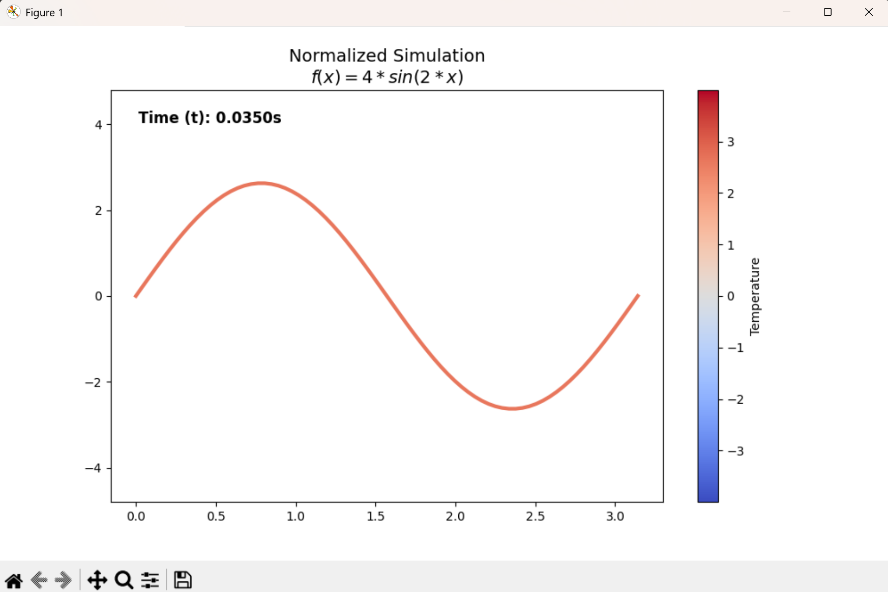
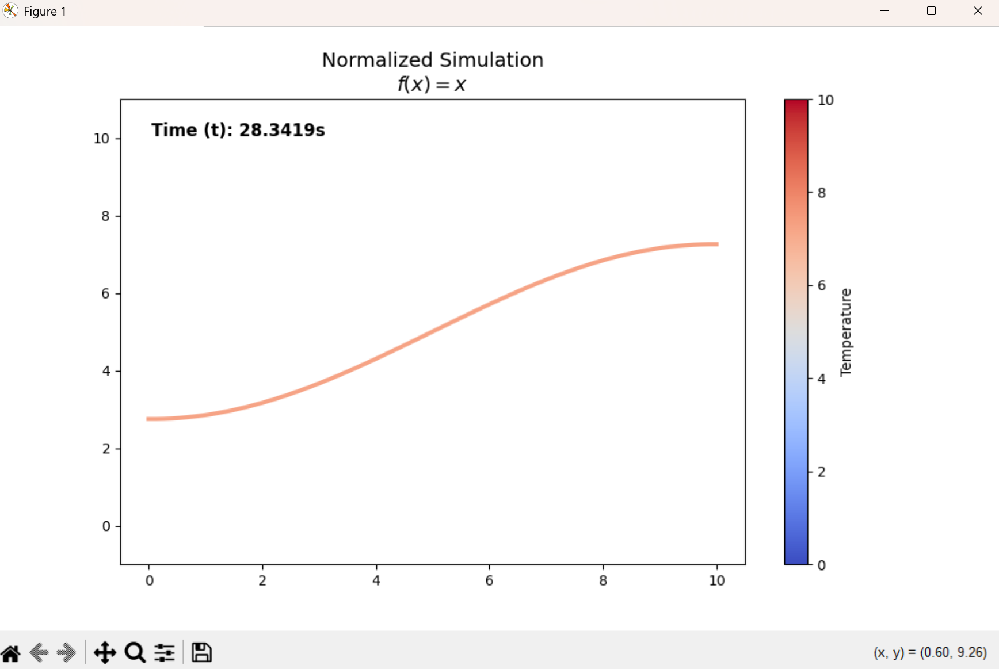

# MA303 Project: 1D Heat Equation Numerical Simulator

### Project Overview
This project is an interactive numerical solver developed for MA303 (Differential Equations). It simulates the heat distribution in a 1D rod over time, allowing for real-time visualization of how different physical parameters and boundary conditions affect thermal diffusion.

## 1. The Mathematics
The simulator models the 1D Heat Equation, a parabolic partial differential equation that describes the distribution of heat in a given region over time:

$$\frac{\partial u}{\partial t} = \alpha \frac{\partial^2 u}{\partial x^2}$$

Where:
* $u(x, t)$ is the temperature at position $x$ and time $t$.
* $\alpha$ is the **thermal diffusivity** of the material.

### Numerical Method: Finite Difference (FTCS)
Because analytical solutions (Fourier Series) can be restrictive for complex initial conditions, this tool implements the Forward-Time Central-Space (FTCS) scheme to approximate the solution.

1.  **Spatial Discretization:** The second-order spatial derivative is approximated using a central difference:
    $$\frac{\partial^2 u}{\partial x^2} \approx \frac{u_{i+1}^n - 2u_i^n + u_{i-1}^n}{(\Delta x)^2}$$
2.  **Temporal Discretization:** The first-order time derivative is approximated using a forward difference:
    $$\frac{\partial u}{\partial t} \approx \frac{u_i^{n+1} - u_i^n}{\Delta t}$$

By combining these, we derive the update equation used in the simulator's engine:
$$u_i^{n+1} = u_i^n + \frac{\alpha \Delta t}{(\Delta x)^2} (u_{i+1}^n - 2u_i^n + u_{i-1}^n)$$

### Stability and Normalization
To ensure the simulation does not diverge, the tool enforces the **CFL Stability Criterion**:
$$r = \frac{\alpha \Delta t}{(\Delta x)^2} \le 0.5$$

## 2. Features
* **Interactive GUI:** Input fields for length ($L$), diffusivity ($\alpha$), and initial conditions.
* **Math Expression Parsing:** Supports complex strings like `4*sin(2*x)` or `exp(-x**2)` via SymPy.
* **Boundary Condition Toggle:** 
    * **Dirichlet:** Ends fixed at $0^\circ\text{C}$.
    * **Neumann:** Insulated ends (where $\frac{\partial u}{\partial x} = 0$)
* **Thermal Color Mapping:** The graph dynamically changes color based on temperature intensity (Red = Hot, Blue = Cold).

## 3.  Demos
* **Standard Decay (Dirichlet):** Input $L=\pi, \alpha=3, f(x)=4\sin(2x)$. The wave will maintain its shape while shrinking toward the zero-axis.

* **Insulated Redistribution (Neumann):** Input $L=10, \alpha=0.2, f(x)=x$. The sloped line will rotate and flatten until it becomes a horizontal line at $u=5$ (the average temperature).

