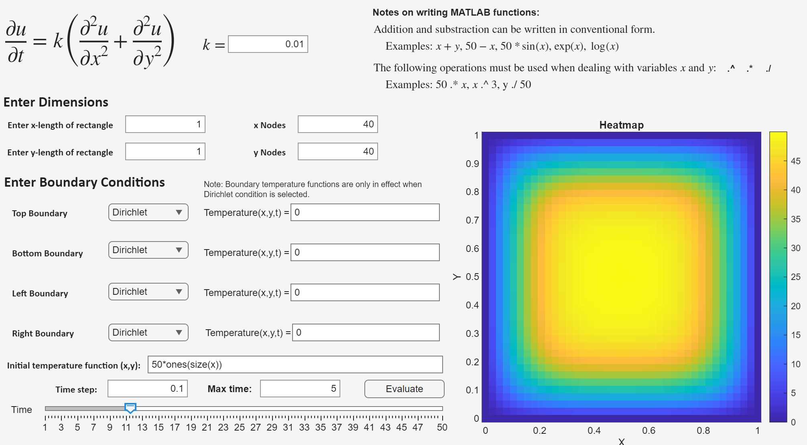

# Applying Crank-Nicolson to Model 2D Heat Equation
YouTube Link: https://youtu.be/pVLWIH1Qj5k 

Documentation: [Latex Document](Finite_Difference_Project.pdf)

To access the MATLAB app, click [here](Heat_SIM.mlapp) and download the file.

## Project Description

Modeling heat conduction in objects involves solving partial differential equations, which are generally difficult, if not impossible. Most solutions to partial differential equations are computed numerically using methods like Finite Difference and Finite Element. The purpose of this project was to build on the numerical methods learned in Chapter 2 of *Differential Equations and Boundary Value Problems: Computing and Modeling, 6e* (C.Henry Edwards, David E. Penney, and David Calvis) by extending it to solving partial differential equations. This project focused on modeling heat equations on bounded rectangular regions using the Crank-Nicolson scheme.

## HEAT_SIM.mlapp User Manual

**Step 1:** Open the **Heat_SIM.mlapp** while having MATLAB installed on your computer. A window exactly like the image below should pop up.

**Step 2:** There are general MATLAB syntax instructions written in the upper right corner of the UI window for writing MATLAB functions. Everything else in the window is customizable input from the user. Freely change your parameters like *k*, *x* length, *y* length, number of nodes in *x* and *y*, time step, and the maximum time you want to run the simulation.

There are boundary conditions on the left of the window, which are drop-down menus with two options: Dirichlet and Neumann. When the Dirichlet condition is chosen for one of the boundaries, make sure to define the temperature function **Temperature(*x,y,t*)**. This does not need to be done when the Neumann condition is chosen.

**Step 3:** When everything is set, press the **Evaluate** button. The app should display a heatmap that agrees with your initial temperature function. Freely move the Time slider to observe the evolution of the heat content in the region through time.

